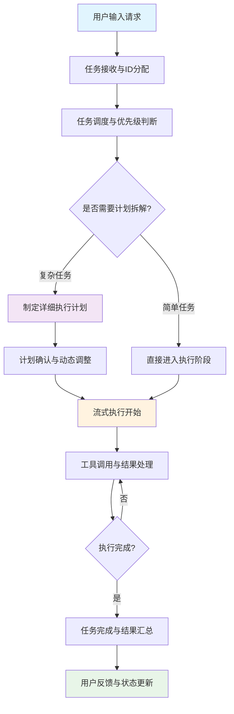
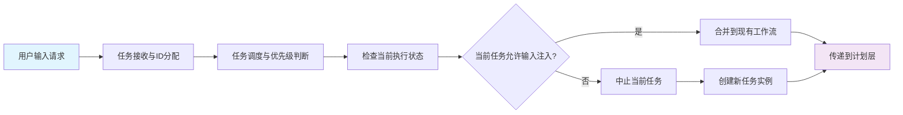
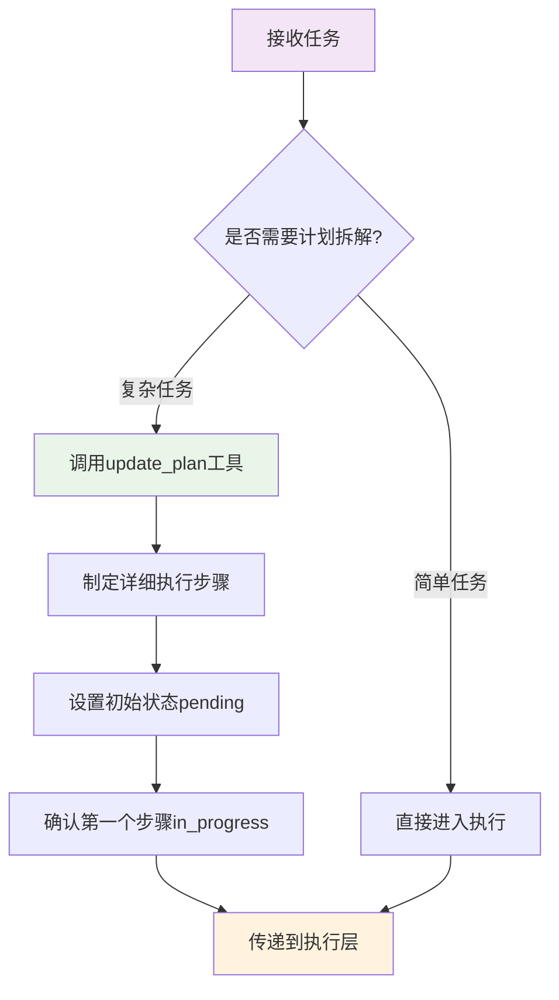
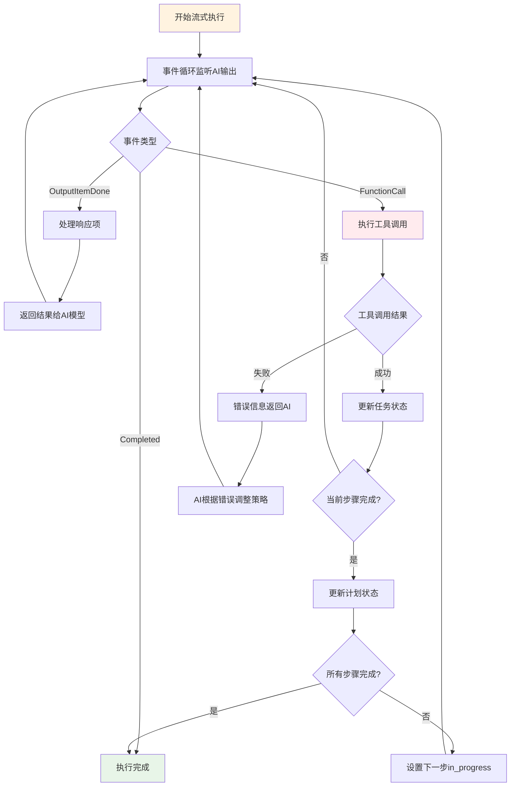

# Codex Agent 工作流程技术分析

## 概述

Codex Agent 是一个OpenAI 的基于 Rust 实现的智能编程助手系统，采用流式处理架构来处理用户请求。最近大放异彩，甚至有超过 Claude Code 的趋势。这里试图分析其核心工作流程，包括任务接收、智能拆解和流式执行三个关键阶段。

## 1. 任务接收与调度机制

Codex Agent 的任务处理始于用户请求的接收。系统采用异步通道模式实现任务的生产者-消费者分离，确保高并发场景下的稳定性和可扩展性。

任务接收流程通过 `CodexConversation` 结构体实现，该结构体负责管理任务的唯一标识生成和异步投递。每个任务都被赋予一个原子递增的 ID，确保在整个会话生命周期内的唯一性和可追踪性。

```rust
pub async fn submit(&self, op: Op) -> CodexResult<String> {
    let id = self.next_id.fetch_add(1, std::sync::atomic::Ordering::SeqCst).to_string();
    let sub = Submission { id: id.clone(), op };
    self.submit_with_id(sub).await?;
    Ok(id)
}

pub async fn submit_with_id(&self, sub: Submission) -> CodexResult<()> {
    self.tx_sub.send(sub).await
        .map_err(|_| CodexErr::InternalAgentDied)?;
    Ok(())
}
```

任务调度器 `submission_loop` 负责处理不同类型的操作，包括用户输入、回合上下文覆盖、审批决策等。调度器采用互斥任务执行策略，确保任何时刻只有一个活跃任务，避免并发执行带来的状态竞争问题。

当接收到新任务时，系统首先检查当前是否有正在执行的任务。如果当前任务允许输入注入，新任务会被直接合并到现有工作流中；否则，系统会中止当前任务并创建新的任务实例。这种设计既保证了执行的一致性，又提供了足够的灵活性来处理突发需求。

## 2. 智能任务拆解机制

Codex Agent 最核心的特性之一是其智能任务拆解能力。系统通过 `update_plan` 工具实现复杂任务的分阶段管理，将用户的高层次需求转化为可执行的具体步骤。

### 2.1 计划工具架构

`update_plan` 工具采用严格的 JSON Schema 定义，确保计划数据的结构化和类型安全。工具支持计划步骤的状态管理，每个步骤可以处于 pending、in_progress 或 completed 三种状态，且同一时间只有一个步骤能够处于 in_progress 状态。

```rust
pub(crate) static PLAN_TOOL: LazyLock<OpenAiTool> = LazyLock::new(|| {
    let mut plan_item_props = BTreeMap::new();
    plan_item_props.insert("step".to_string(), JsonSchema::String { description: None });
    plan_item_props.insert(
        "status".to_string(),
        JsonSchema::String {
            description: Some("One of: pending, in_progress, completed".to_string()),
        },
    );

    let plan_items_schema = JsonSchema::Array {
        description: Some("The list of steps".to_string()),
        items: Box::new(JsonSchema::Object {
            properties: plan_item_props,
            required: Some(vec!["step".to_string(), "status".to_string()]),
            additional_properties: Some(false),
        }),
    };

    OpenAiTool::Function(ResponsesApiTool {
        name: "update_plan".to_string(),
        description: r#"Updates the task plan.
Provide an optional explanation and a list of plan items, each with a step and status.
At most one step can be in_progress at a time."#.to_string(),
        parameters: JsonSchema::Object {
            properties: {
                "explanation".to_string(),
                JsonSchema::String { description: None },
                "plan".to_string(),
                plan_items_schema,
            },
            required: Some(vec!["plan".to_string()]),
            additional_properties: Some(false),
        },
    })
});
```

### 2.2 计划执行机制

`update_plan` 工具在 Codex 中扮演着一个特殊的角色：它**不是任务执行控制器，而是状态管理和进度跟踪工具**。真正的执行顺序由 AI 模型根据计划内容自主决定，这使得系统具备了传统项目管理工具所不具备的智能性和适应性。

#### 智能自主执行模式

Codex 采用智能自主执行模式，其工作流程如下：

1. **计划提供指导**：`update_plan` 为 AI 提供清晰的路线图和进度跟踪
2. **AI 自主决策**：AI 根据当前计划和实际情况决定下一步做什么
3. **状态同步更新**：每完成一个步骤，AI 会调用 `update_plan` 更新状态

这种设计避免了传统任务执行器的僵化特性，让 AI 能够根据实时情况做出最佳决策。

#### 多层错误处理机制

当执行过程中遇到问题时，Codex 具备了完善的错误处理策略：

**工具级别错误处理**：
```rust
// codex.rs:1433-1434
let output = match result {
    Ok(content) => content,
    Err(FunctionCallError::RespondToModel(msg)) => msg,
};
```

当工具调用失败时，错误信息会返回给 AI 模型，让模型根据错误类型智能调整执行策略。

**智能重试和替代方案**：
AI 模型会根据错误类型采取不同策略：
- **临时错误**：重试相同的操作
- **权限错误**：请求用户批准或使用替代方案
- **逻辑错误**：调整实现方案
- **依赖问题**：先解决依赖问题再继续

**动态计划调整**：
当遇到严重问题时，AI 会调用 `update_plan` 重新评估和调整计划：
```javascript
// 示例：遇到问题时的计划调整
"update_plan": {
  "explanation": "数据库连接失败，需要先检查配置",
  "plan": [
    {"step": "检查数据库配置文件", "status": "in_progress"},
    {"step": "测试数据库连接", "status": "pending"},
    {"step": "设计数据库结构", "status": "pending"},
    {"step": "创建用户认证模块", "status": "pending"}
  ]
}
```

#### 具体错误处理场景

**场景1：工具执行失败**
AI 会分析失败原因并采取相应措施，如网络超时时检查网络连接，权限错误时请求用户批准，依赖冲突时尝试解决冲突等。

**场景2：设计问题**
如果在实现过程中发现架构设计有问题，AI 会重新设计架构，更新实现计划，然后继续开发。这种能力让系统能够在执行过程中进行自我修正。

**场景3：意外发现**
在执行过程中如果发现新的需求或约束，AI 会及时调整计划以适应新情况，确保最终结果符合用户的真实需求。

#### 计划粒度控制

计划的粒度控制是关键设计考虑。每个计划步骤都采用简洁的自然语言描述，通常长度控制在 5-15 个词之间，确保既提供足够的指导信息，又避免过度细化导致的执行效率下降。同时，计划的动态调整能力让系统能够保持足够的灵活性来应对复杂多变的开发环境。

## 3. 流式执行架构

Codex Agent 采用流式处理架构实现实时的任务执行和结果反馈。系统通过事件循环机制持续处理 AI 模型的输出，每个工具调用完成后立即执行并返回结果，实现边生成边执行的流式工作模式。

### 3.1 流式响应处理

流式响应处理的核心在于 `try_run_turn` 函数中的事件循环机制。系统持续监听 AI 模型的输出流，对不同类型的事件进行相应处理：

```rust
loop {
    let event = stream.next().await;
    let Some(event) = event else {
        return Err(CodexErr::Stream(
            "stream closed before response.completed".into(),
            None,
        ));
    };

    match event {
        ResponseEvent::OutputItemDone(item) => {
            let response = handle_response_item(
                sess, turn_context, turn_diff_tracker, sub_id, item.clone()
            ).await?;
            output.push(ProcessedResponseItem { item, response });
        }
        ResponseEvent::Completed { response_id: _, token_usage } => {
            sess.update_token_usage_info(sub_id, turn_context, token_usage.as_ref()).await;
            return Ok(TurnRunResult {
                processed_items: output,
                total_token_usage: token_usage,
            });
        }
        // 处理其他事件类型...
    }
}
```

### 3.2 工具调用执行机制

工具调用处理采用统一的入口函数 `handle_response_item`，支持多种工具类型包括内置工具、MCP 工具和自定义工具。每个工具调用都经过参数解析、安全检查、执行和结果处理四个阶段。

```rust
async fn handle_response_item(
    sess: &Session,
    turn_context: &TurnContext,
    turn_diff_tracker: &mut TurnDiffTracker,
    sub_id: &str,
    item: ResponseItem,
) -> CodexResult<Option<ResponseInputItem>> {
    match item {
        ResponseItem::FunctionCall { name, arguments, call_id } => {
            let result = handle_function_call(
                sess, turn_context, turn_diff_tracker, sub_id.to_string(),
                name.to_owned(), arguments.to_owned(), call_id.clone()
            ).await;

            let output = match result {
                Ok(content) => FunctionCallOutputPayload {
                    content, success: Some(true),
                },
                Err(FunctionCallError::RespondToModel(msg)) => FunctionCallOutputPayload {
                    content: msg, success: Some(false),
                },
            };
            Some(ResponseInputItem::FunctionCallOutput { call_id, output })
        }
        // 处理其他响应类型...
    }
}
```

工具执行采用严格的错误处理机制，当工具调用失败时，系统会将错误信息返回给 AI 模型，模型可以根据错误信息调整执行策略。这种反馈循环确保了系统的容错能力和适应性。

## 4. 系统工作流程

基于以上分析，Codex Agent 的完整工作流程可以概括为以下步骤：



Codex Agent 的工作流程分为三个核心层次：

**输入层**：负责接收用户请求并进行任务初始化，包括请求接收、唯一ID分配和任务调度。

**计划层**：智能判断任务复杂度，对复杂任务进行拆解和计划制定，对简单任务直接进入执行。

**执行层**：采用流式执行模式，通过事件循环处理工具调用和结果反馈，支持错误恢复和动态调整。

### 输入层流程



### 计划层流程



### 执行层流程



## 5. 技术优势分析

Codex Agent 的工作流程设计体现了多个重要的技术优势：

**顺序执行保证一致性**：单任务执行策略避免了并发执行带来的状态竞争和数据一致性问题，确保了每个任务的执行质量。

**流式处理提升体验**：实时反馈机制让用户能够及时了解任务进展，减少了等待时间，提升了交互体验。

**智能拆解增强能力**：动态的计划制定和调整机制让系统能够灵活应对各种复杂任务，提高了系统的适应性和智能化水平。

**错误处理确保可靠性**：完善的错误处理和恢复机制让系统具备了较强的容错能力，能够在遇到问题时自动调整策略。

## 6. 应用价值

Codex Agent 的工作流程设计为 AI 辅助编程系统提供了宝贵的实践经验。其任务调度、智能拆解和流式执行的架构模式，可以作为设计类似系统的重要参考。

特别是在任务拆解机制方面，Codex 展示了如何将用户的抽象需求转化为具体的可执行步骤，以及如何在执行过程中保持足够的灵活性和适应性。这些设计思路对于构建更加智能和实用的 AI 助手系统具有重要的指导意义。
